# easy-code
&emsp;&emsp;简单易用的开发辅助工具，集成了诸多开发时常用的功能

## 代码生成器

&emsp;&emsp;根据表信息快速生成代码，支持自定义模板

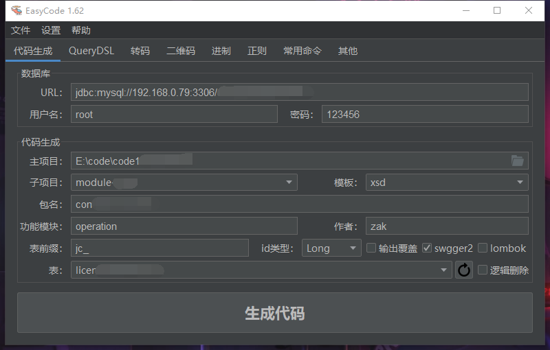

## QueryDSL工具

&emsp;&emsp;当项目使用QueryDSL作查询时，首先需要根据实体类生成一个Q类，隐因此增加快速生成工具

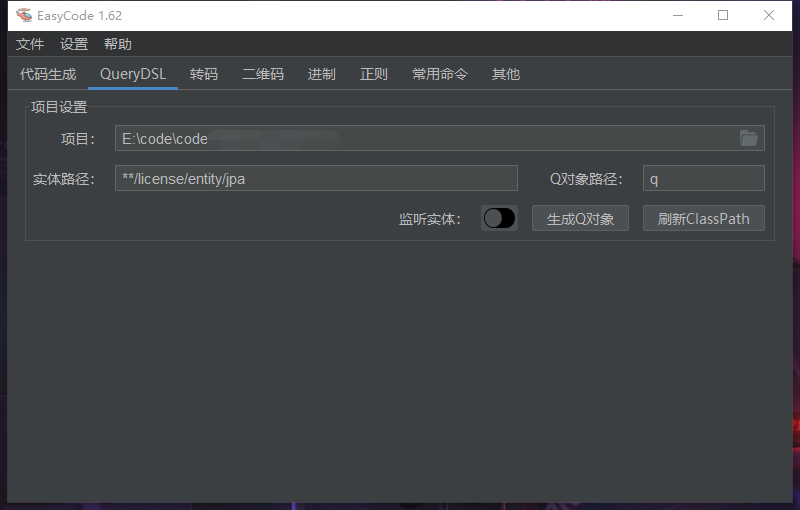

## 提供常用的编码和转换

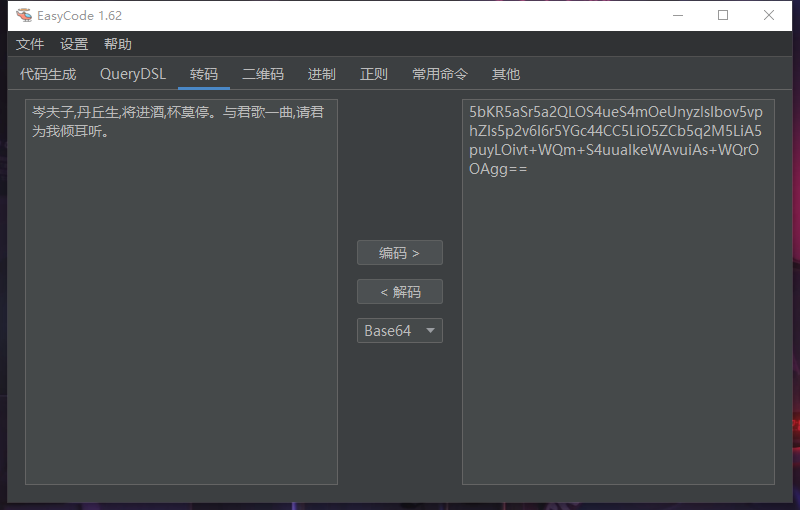

## 提供条码、二维码的生成和识别

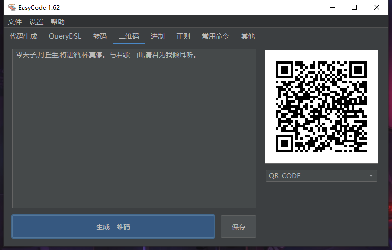

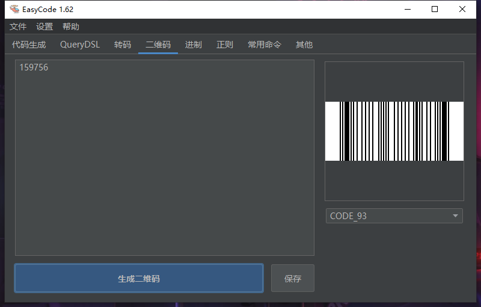

## 常用进制转换

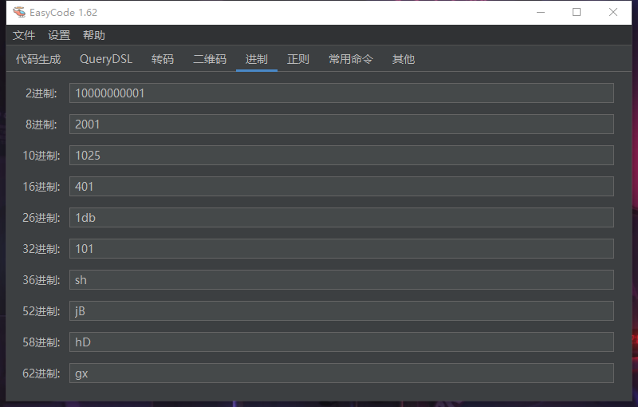

## 常用正则列表和测试

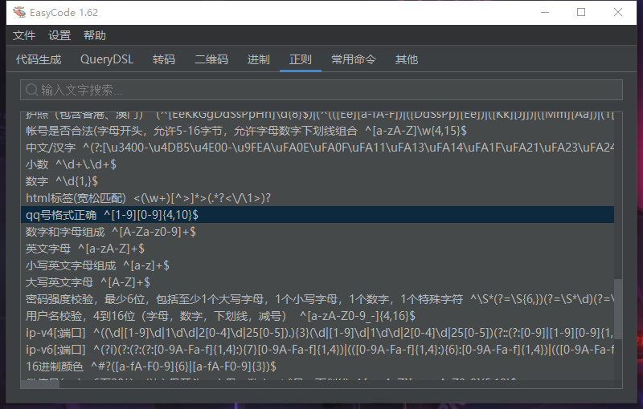

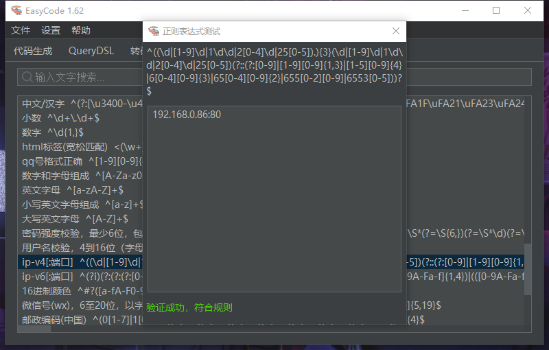

## 常用命令列表

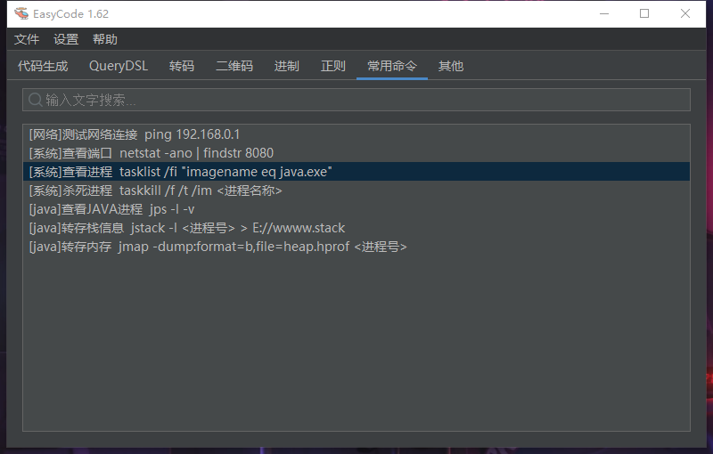

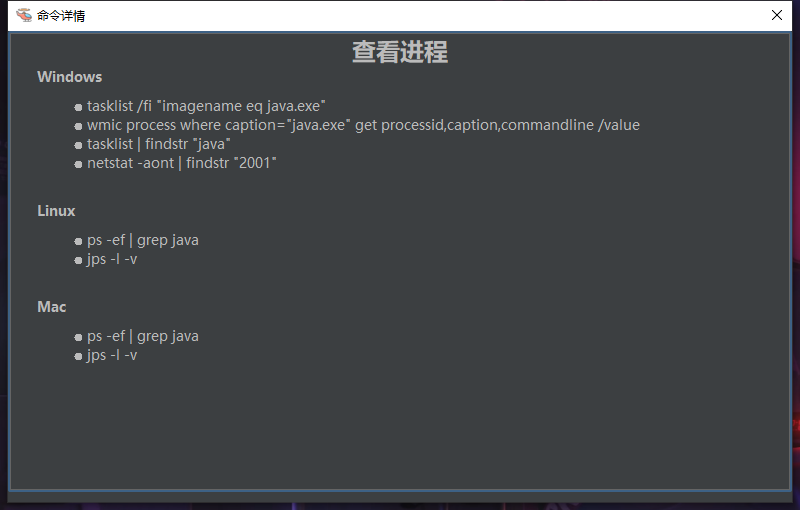

## 假数据生成
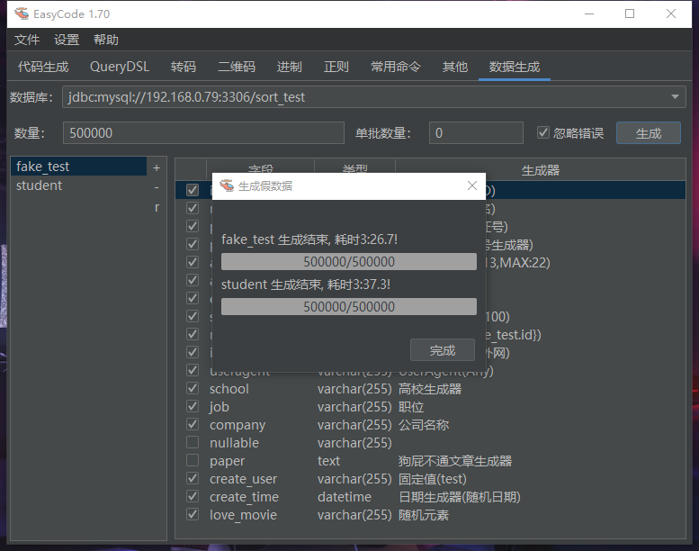

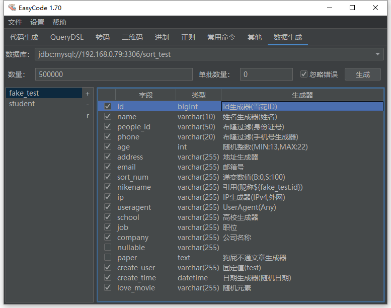

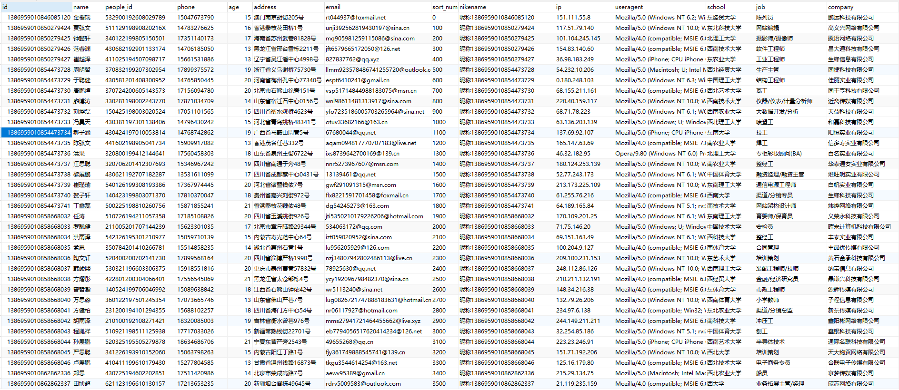

## 其他一些小工具

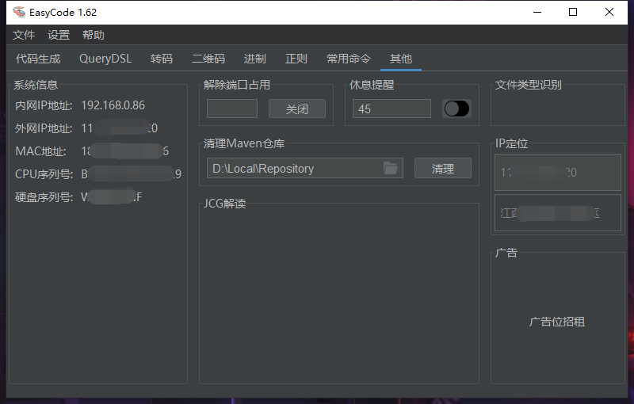